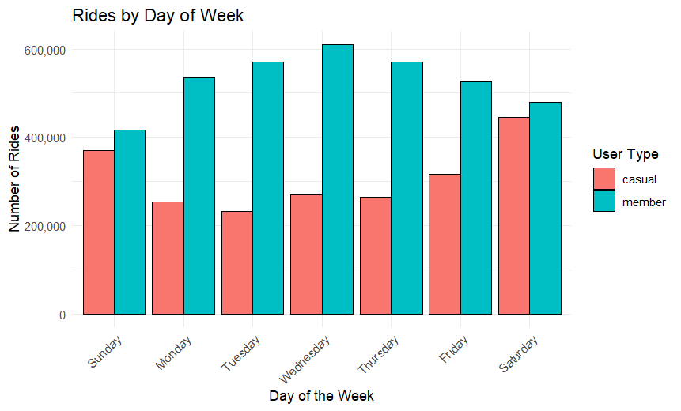
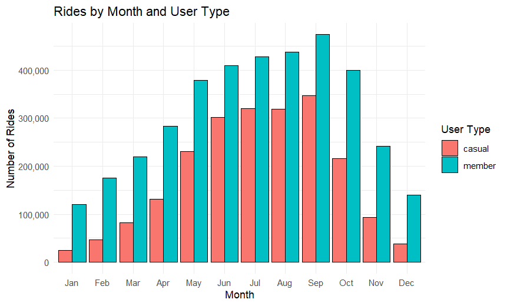
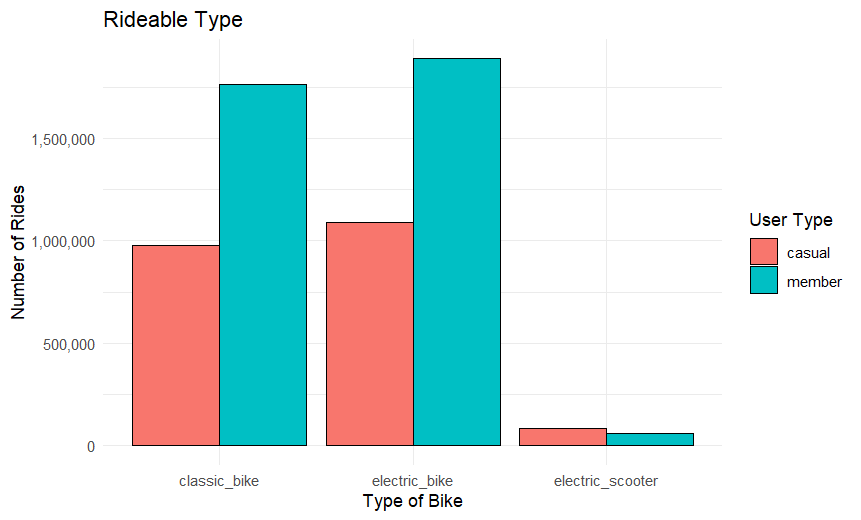
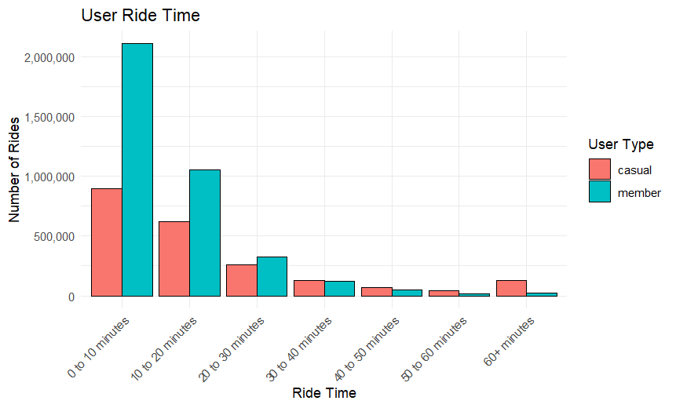

# Google Data Analytics Case Study 1: Divvy Bike-Share
### Robert Zurawski
### 03/01/2025

## Introduction

This is optional path 1 of the Google Professional Data Analytics Certification Capstone project. In this case study, I will be using R to perform a real-world task for a fictional company in order to demonstrate the analytic ability of a junior data analyst. Data was collected from the real bike-share company, Divvy.

### Scenario

I am a junior data analyst working on the marketing analyst team at Cyclistic, a bike-share company in Chicago. The director of marketing believes the company’s future success depends on maximizing the number of annual memberships. Therefore, my team wants to understand how casual riders and annual members use Cyclistic bikes differently. From these insights, my team will design a new marketing strategy to convert casual riders into annual members. But first, Cyclistic executives must approve my recommendations, so they must be backed up with compelling data insights and professional data visualizations.

### About the Company.

Cyclistic is a bike-share program that features more than 5,800 bicycles and 600 docking stations. Cyclistic sets itself apart by also offering reclining bikes, hand tricycles, and cargo bikes, making bike-share more inclusive to people with disabilities and riders who can't use a standard two-wheeled bike. The majority of riders opt for traditional bikes; about 8% of riders use the assistive options. Cyclistic users are more likely to ride for leisure, but about 30% use the bikes to commute to work each day.

### Key Shareholders

Lily Moreno: The director of marketing and my manager. Moreno is responsible for the development of campaigns and initiatives to promote the bike-share program. These may include email, social media, and other channels.

Cyclistic executive team: The notoriously detail-oriented executive team will decide whether to approve the recommended marketing program.

### Business Task:

Three questions will guide the future marketing program:

1.  How do annual members and casual riders use Cyclistic bikes differently?

2.  Why would casual riders buy Cyclistic annual memberships?

3.  How can Cyclistc use digital media to influence casual riders to become members?

### About the Data.

In this Project, we collected data from the bike-share company Divvy. We collected the most recent 12 months of data, from January 2024 to December 2024. The data had all the information we needed, most importantly, start and end time, which included the date, and time of day they started and finished their ride. First, we cleaned this data by making sure all of the dates and times were in the proper format. Then we transformed this data to show us the day of week, ride time, and the month name. We used these variables to see what the differences in behavior are for annual members and casual riders.

### Graphing our findings

#### Day of Week

  First, we had a suspicion that annual members use the service more on weekdays for transportation to and from work, while casual members use it more on weekends for leisure. We confirmed that suspicion by plotting the counts for each type of user compared with the day of the week. In order to convert these casual riders into annual memberships, we can launch a new weekend only membership. This will be offered at a slight discount and have an "Upgrade to Annual Membership" option. 

#### Rider Seasonality

  Next, since the data measures users in Chicago, we assumed all users would take a dip during the Winter months. If this hypothesis is correct, it will not affect our analysis, but we still must check to make sure there are no other patterns between user types. The team confirmed this by graphing rides per month for casual riders and annual members.

#### Kind of Bike

  The data shows bike usage differences between annual members and casual riders. Annual members have much higher overall use than casual riders. Both users prefer the electric bikes to a classic bike, but there isn't a huge discrepancy between these. Casual riders ride electric scooters more than annual members, but overall scooter usage is comparatively low to bikes.

#### Ride Time

  To get an idea of how long users were riding, we broke down ride time between casual riders and annual members. Overall, most users were riding for less than 20 minutes a session, however, longer rides are more popular with casual riders than annual members. Because of this, we should consider targeting casual users with longer rides with email signups that will get them a slightly discounted ride. We can then start an email advertising campaign to sway these casual users. 

### Conclusion

Our analysis shows that casual users tend to ride more on weekends. Only a small percentage of these weekend riders are repeat users (.01%). Also, while the majority of both types of riders aren't taking long rides, casual users take more long rides.

## Recommendation

From our findings, we recommend:

1.  Creating repeat casual customers by using targeting advertising on social media. We can target our weekend casual riders and launch ads from Thursdays to Sundays on their social media platforms.

2.  Convert the repeat casual users into membership users by creating a weekend only membership. This will be offered at a slight discount from the annual membership and will also include an "upgrade to annual membership" option.

3.  Consider targeting casual users on longer rides with email sign ups for a slightly discounted ride in order to start an email advertising campaign to sway casual users.
